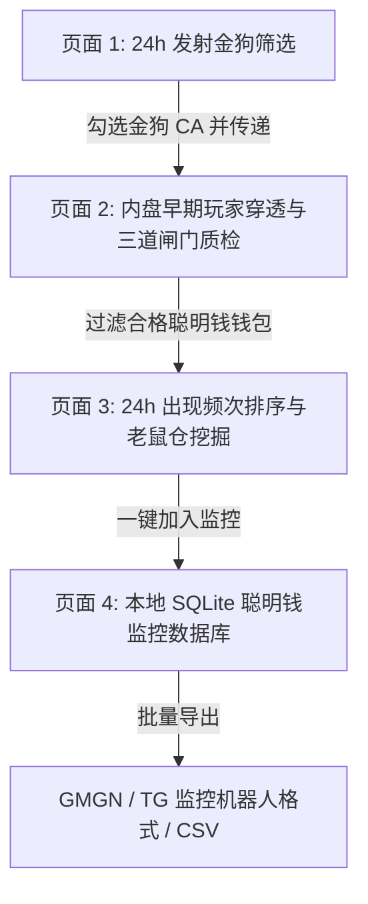

# Robinhood Radar (Robinhood 链聪明钱与阴谋老鼠仓雷达) - 开发进度与功能实现报告

> **项目名称**：Robinhood Chain Alpha Radar  
> **远程仓库**：`https://github.com/chichimon14/robinhood-radar`  
> **服务端口**：`http://127.0.0.1:8888`  
> **适用公链**：Robinhood Chain (Arbitrum Orbit L2, Chain ID: 4663, 块时间约 0.10 秒)  
> **更新时间**：2026 年 09 月 04 日  

---

## 一、 当前开发进度概述

Robinhood Radar 是专为 Robinhood 链 Meme/代币生态打造的**链上早期地址深度穿透、跨币频次碰撞、聪明钱质检与阴谋老鼠仓追踪回测分析系统**。

目前项目已经完成**端到端全链路闭环开发**与**生产级高可用优化**，三大核心业务页面及本地监控数据库已全部实现并打通。



---

## 二、 已实现核心功能详述

### 1. 页面 1：24 小时新发射金狗筛选 (Token Radar)

- **精准时间窗口与自选区间**：
  - 默认以**北京时间早 8:00 至次日早 8:00** 为计算周期；
  - 严格以代币**迁移到外盘的时间（`open_timestamp` / `is_out_market`）**为准；
  - 支持用户在前端自选任意开始与结束时间（精确到年月日时分），内置跨浏览器、跨系统的健壮时间解析器。
- **高门槛优质金狗初筛**：
  - 聚合 GMGN 官方 24h/6h/1h/new_pairs 多周期多维度排行行情池（每批次扫描 400+ 个候选币）；
  - 筛选历史最高市值 ATH $\ge \$500\text{k}$（可自由调节），确保只追踪真实大金狗。
- **全维度元数据与真实指标补充**：
  - **持币人数**：调用 GMGN 官方代币详情接口精准补充真实持币地址数，彻底解决显示为 0 的问题；
  - **社交媒体全覆盖**：自动提取 Twitter/X、Telegram、官方网站、Discord、YouTube、TikTok 等社交媒体，并以简洁图标方式排布展示；
  - **外盘迁移时间**：显示外盘开盘时间及距今已迁移时长（如 `🔥 迁移 7.9 小时前`）；
  - **一键快捷复制**：代币名称旁提供纯图标一键复制合约地址（CA）与 GMGN 行情跳转。
- **智能请求与 Cloudflare WAF 穿透**：
  - 采用标准且经过生产环境验证的轻量浏览器请求头，彻底根除了 Cloudflare 403 Forbidden 拦截风险；
  - 先完成时间与市值初筛，再对达标的二三十个金狗并发补充社交信息，杜绝高频 429 报错。
- **批量勾选联动**：
  - 扫描结果默认全选；
  - 支持一键全选/反选与单个勾选；
  - 动态显示已选代币数量，点击“开始穿透内盘”仅对勾选的代币进行内盘深度挖掘。

---

### 2. 页面 2：内盘聪明钱挖掘与三道质检闸门 (Smart Money Hunter)

- **内盘阶段 (Pre-launch / Bonding Curve) 穿透**：
  - 基于 Robinhood 链 RPC 节点，精准定位目标金狗代币从部署到迁移外盘前的全部链上出块与买入事件；
  - 排除系统路由（Router/Vault/Deployer/Dead）地址，提取全部真实内盘早期潜伏买入地址。
- **三道质检闸门（支持独立复选框自由组合）**：
  - 前端各条件均配有复选框，用户可按需勾选启用或禁用任意条件：
    1. **交易活跃度门槛**：近 30 天内交易活跃天数 $\ge X$ 天（默认 7 天）；
    2. **GMGN 7 天真实胜率**：GMGN 官方统计的 7D 交易胜率 $\ge Y\%$（默认 50%）；
    3. **GMGN 7 天已实现利润**：GMGN 官方统计的 7D 已实现盈利 $\ge Z$ 美元（默认 \$10,000）；
- **内盘命中代币数量与悬浮展示**：
  - 严格只展示该地址在**页面 1 所勾选代币中**命中的内盘代币数量；
  - 鼠标悬浮在数量标签上时，浮窗动态展示其具体买入参与的代币符号列表（如 `GME, 18932, CRCL`）；
- **质检状态可视化**：
  - 直观显示该地址是否通过三道闸门，高亮标明各项指标。

---

### 3. 页面 3：按 24h 出现频次严格排序 (Frequency Ranking & Cabal Radar)

- **跨币频次碰撞矩阵**：
  - 将内盘提取出的有效聪明钱地址，严格按**过去 24 小时内参与的内盘代币数量（频次）从多到少**降序排列；
  - 优先识别高频次出现在多个热门金狗内盘的“常胜将军”和“联合老鼠仓”；
  - 次要排序维度：7 天已实现利润、7 天胜率。
- **智能画像行为标签**：
  - `[Cabal / 老鼠仓]`：多次在内盘或开盘极早期精准潜伏；
  - `[Smart Money / 聪明钱]`：高胜率、高回报率、波段逃顶能力强；
  - `[Sniper / 极速狙击手]`：多币开盘极速上车。
- **快捷操作与持久化沉淀**：
  - 支持一键全选/单选优质地址；
  - 支持**一键加入本地监控库**；
  - 支持导出为标准 CSV 报表，或一键复制为 GMGN / Telegram 监控机器人批量监听格式。

---

### 4. 页面 4：本地监控钱包数据库 (Local SQLite DB)

- **本地轻量高可靠存储**：
  - 内置 SQLite 数据库（`data/wallets.db`），保障数据在断网或重启后安全持久化；
- **全方位管理检索**：
  - 支持按钱包地址模糊搜索；
  - 支持按 24h 内盘频次、7D 胜率、7D 利润、添加时间正逆序灵活排序；
  - 支持就地编辑修改备注，支持一键清空或删除单条记录。

---

### 5. 系统级控制与桌面一键启停集成

- **桌面开关与快捷集成**：
  - 配套 `Robinhood雷达开关.app` 及 `.command` 脚本，双击即可一键在后台开启/关闭所有雷达服务；
  - 服务就绪后自动唤起系统默认浏览器（Brave / Chrome / Safari）打开 `http://127.0.0.1:8888`；
  - 关闭服务时自动清理关联后台进程并安全关闭对应的浏览器标签页；
  - 提供 `Robinhood雷达网页.webloc` 桌面快捷图标，支持直达页面。
- **网络与代理隔离**：
  - 内置代理自动绕过逻辑，防止本地代理冲突导致接口 403 或本地连接拒绝。

---

## 三、 目录结构说明

```text
gmgn/
├── backend/                  # 后端核心逻辑
│   ├── api.py               # FastAPI 路由端点与参数校验
│   ├── config.py            # 核心配置 (RPC 节点、公链 ID、区块参数)
│   ├── db.py                # SQLite 数据库模型与 CRUD
│   ├── gmgn_client.py       # GMGN API 客户端
│   ├── rpc_client.py        # Robinhood 链 JSON-RPC 节点交互
│   ├── token_scanner.py     # 24h 发射金狗与外盘迁移行情扫描器
│   └── wallet_hunter.py     # 内盘交易日志穿透与三道门槛质检引擎
├── frontend/                 # 前端单页面应用
│   └── index.html           # 响应式 Web 界面 (TailwindCSS + Lucide Icons)
├── scripts/                  # 运维与桌面集成脚本
│   └── toggle_service.sh    # 一键启停服务、网络净化与浏览器标签联动脚本
├── run.sh                    # 终端一键运行脚本
├── README.md                 # 快速入门与架构说明
├── DEVELOPMENT_PROGRESS.md   # 开发进度与功能详述文档
└── .gitignore                # Git 忽略配置 (排除虚拟环境、日志与系统临时文件)
```

---

## 四、 声明与协作约定

- **代码上传规范**：所有代码严格遵守用户指令进行同步与备份，**未获得用户明确授权与命令前，严禁任何形式的私自推送与上传**。
